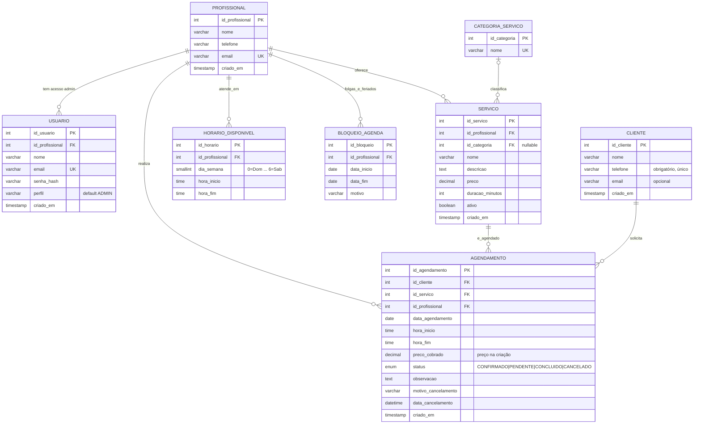
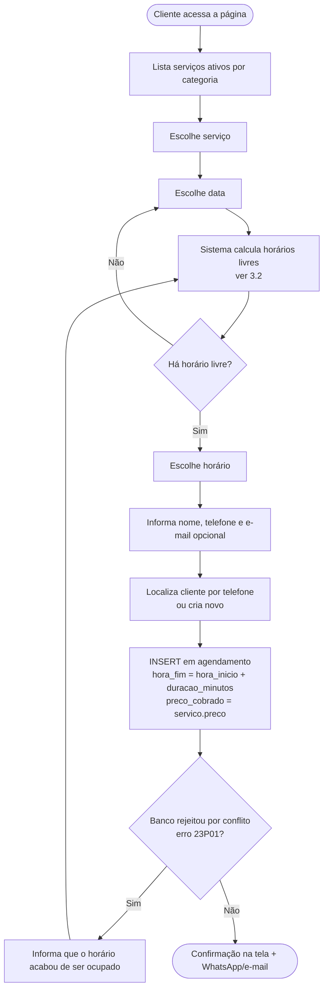
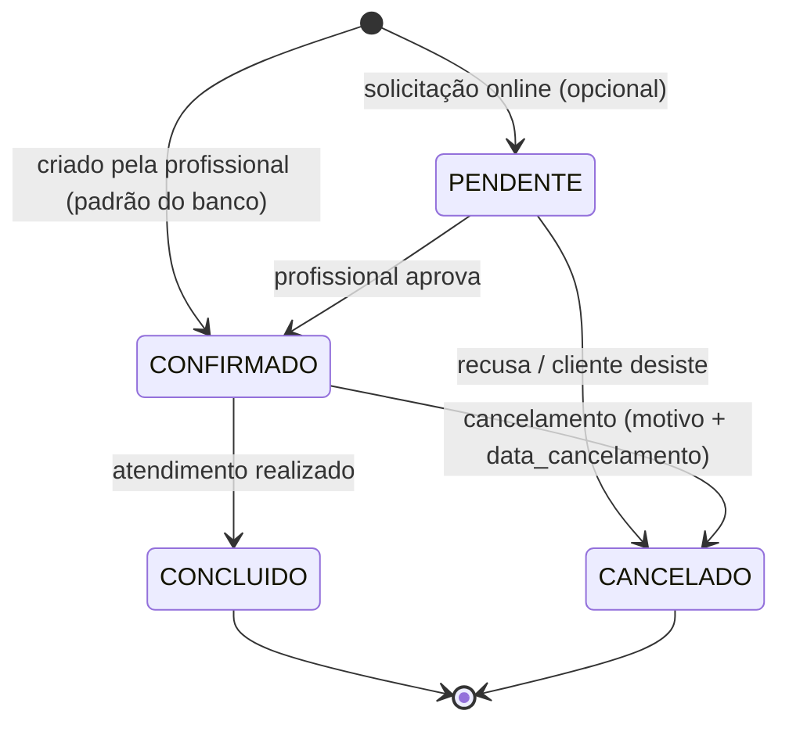

# Sistema de Agendamento — Modelagem inicial

> Projeto Integrador em Computação II · UNIVESP · **Grupo 4**
> Título provisório: *Sistema Web para Gestão de Serviços e Agendamentos: Uma Solução Tecnológica para Profissionais Autônomos*
>
> Este documento descreve o **modelo de dados**, os **fluxos principais** e a **interface web**,
> alinhados ao **Plano de Ação do grupo** (`PLANO DE AÇÃO GRUPO 4.pdf`).

---

## 0. Alinhamento com o Plano de Ação

**Stack definida no plano (Quinzena 4):**

| Camada | Tecnologia do plano | Onde está neste repositório |
|---|---|---|
| Banco relacional | **PostgreSQL** | `database/01_schema.sql`, `02_seed_dev.sql`, `03_testes_regras.sql` |
| API | **Node.js + Express** (API REST) | a fazer — `backend/` |
| Interface | **React.js** | a fazer — `frontend/` |
| Requisitos transversais | Acessibilidade, responsividade (computador e celular), controle de versão (Git), testes | ver seção 5 |

> ⚠️ **O `.sql` original (`Sistema-Agendamento (3).sql`) é MySQL**, mas o plano define **PostgreSQL**.
> Por isso foi feita uma **adaptação para PostgreSQL** em `database/`, mantendo as mesmas tabelas e
> colunas. O arquivo MySQL foi mantido intacto como referência. As diferenças estão na seção 4.

**Em que etapa estamos** (hoje: 29/09/2026):

| Quinzena | Período | Atividade do plano | Situação |
|---|---|---|---|
| 3 | 07/09–20/09 | *Iniciar a modelagem do sistema: banco de dados e principais fluxos* (Mayer e Nicolas) | ✅ este documento + `database/` |
| 4 | 21/09–30/09 | Estrutura inicial do banco **PostgreSQL** (Mayer e Samara) | ✅ schema pronto e testado; falta conectar à API |
| 4 | 21/09–30/09 | API REST Node/Express (Mayer e Nicolas) | ⏳ próximo passo |
| 4 | 21/09–30/09 | Protótipo React (Edinaldo e Lucas) | ⏳ em paralelo |
| 4 | até **30/09** | **Entrega do Relatório Parcial** (Samara) | ⚠️ prazo amanhã — este material serve de insumo |
| 5 | 05/10–18/10 | Aprimorar serviços, agendamento/disponibilidade, prevenção de conflitos, acessibilidade, testes | — |
| 6 | 19/10–01/11 | Testes funcionais/integração, acessibilidade, validação com a profissional | — |
| 7 | 02/11–06/11 | Vídeo e Relatório Final (entrega **06/11**) | — |

**Escopo funcional (do plano):** cadastro de serviços e preços; definição de dias e horários de
atendimento; consulta de serviços e **auto-agendamento pelo cliente**; **prevenção de conflitos de
horário**; uso em computador e celular.

---

## 1. Visão geral do domínio

Sistema para uma profissional autônoma da área da beleza (cenário inicial: cabeleireira; dados de teste: *Mariana Souza*)
gerenciar **serviços**, **horários de atendimento** e **agendamentos** de clientes.

Atores:

| Ator | O que faz |
|---|---|
| **Cliente** | Escolhe serviço, dia e horário; recebe confirmação; pode cancelar. |
| **Profissional / Admin** (`usuario`) | Faz login, vê a agenda, cria/edita/cancela/conclui agendamentos, gerencia serviços, categorias, clientes e horários. |

---

## 2. Modelo de dados (MER) — versão PostgreSQL



### 2.1 Dicionário resumido

| Tabela | Papel | Regras no banco |
|---|---|---|
| `profissional` | Quem presta o serviço | `email` único |
| `usuario` | Login do painel administrativo | `email` único; `perfil` restrito a `ADMIN`/`PROFISSIONAL`; `senha_hash` (bcrypt) |
| `categoria_servico` | Agrupa serviços (Cabelo, Estética, Manicure e Pedicure) | `nome` único |
| `servico` | Catálogo com preço e duração | `preco >= 0`, `duracao_minutos > 0`; `ativo` desliga sem apagar |
| `horario_disponivel` | Grade semanal recorrente de atendimento | `hora_fim > hora_inicio`; **janelas do mesmo dia não podem se sobrepor** |
| `bloqueio_agenda` | Folgas, feriados, férias (intervalo de datas) | `data_fim >= data_inicio` |
| `cliente` | Quem agenda | `telefone` obrigatório e **único** (identifica o cliente sem login) |
| `agendamento` | Reserva de um serviço em data/hora | ver 2.2 |

### 2.2 Regras de negócio garantidas pelo banco

A regra central — **nunca haver dois agendamentos sobrepostos para a mesma profissional** — era feita
por *triggers* no MySQL. No PostgreSQL ela virou uma **restrição de exclusão** (`EXCLUDE USING gist`),
que é declarativa e **segura contra requisições simultâneas** (duas pessoas clicando no mesmo horário
ao mesmo tempo: só uma passa).

| Regra | Como é garantida |
|---|---|
| Sem sobreposição de horários da profissional | `ex_agendamento_sem_conflito` (ignora `CANCELADO`; horários encostados como 10–11 e 11–12 são permitidos) |
| `hora_fim > hora_inicio` | `CHECK` |
| Serviço pertence à profissional do agendamento | FK composta `(id_servico, id_profissional)` |
| Cancelar exige data do cancelamento | `CHECK (status <> 'CANCELADO' OR data_cancelamento IS NOT NULL)` |
| Histórico protegido | FKs de `agendamento` sem `CASCADE` de exclusão → para "remover" um serviço, use `ativo = FALSE` |
| Preço histórico | `preco_cobrado` grava o valor na hora do agendamento |

Quando houver conflito, o PostgreSQL devolve o erro **`23P01` (exclusion_violation)**. A API deve
capturá-lo e responder **HTTP 409** com mensagem amigável ("Esse horário acabou de ser ocupado").

Regras que ficam **na API** (dependem de "agora" e da grade): horário dentro de `horario_disponivel`,
fora de `bloqueio_agenda`, não estar no passado e antecedência mínima. Estão no fluxo 3.2.

Todas as regras do banco têm teste automatizado em `database/03_testes_regras.sql`.

---

## 3. Fluxos principais

### 3.1 Agendamento pelo cliente



### 3.2 Cálculo de horários disponíveis (regra que **não** está no banco)

```mermaid
flowchart LR
    A[Data escolhida] --> B[Converte para dia_semana<br/>0=Dom ... 6=Sab, igual a Date.getDay]
    B --> C[Busca janelas em horario_disponivel]
    C --> C2[Descarta o dia se houver<br/>bloqueio_agenda]
    C2 --> D[Busca agendamentos do dia<br/>status diferente de CANCELADO]
    D --> E[Gera slots de 15 ou 30 min<br/>dentro de cada janela]
    E --> F[Descarta slots em que<br/>slot + duracao ultrapassa a janela]
    F --> G[Descarta slots que<br/>se sobrepõem a um agendamento]
    G --> H[Se for hoje, descarta horários passados]
    H --> I[Lista de horários livres]
```



Consultas de apoio (PostgreSQL; `:x` = parâmetro da API, usar sempre consultas parametrizadas):

```sql
-- Dia bloqueado? (se retornar linha, não há horários)
SELECT 1 FROM bloqueio_agenda
WHERE id_profissional = :prof AND :data BETWEEN data_inicio AND data_fim;

-- Janelas do dia (dia_semana: 0=Dom ... 6=Sáb; no SQL: EXTRACT(DOW FROM :data::date))
SELECT hora_inicio, hora_fim
FROM horario_disponivel
WHERE id_profissional = :prof
  AND dia_semana = EXTRACT(DOW FROM :data::date)
ORDER BY hora_inicio;

-- Ocupação do dia
SELECT hora_inicio, hora_fim
FROM agendamento
WHERE id_profissional = :prof
  AND data_agendamento = :data
  AND status <> 'CANCELADO'
ORDER BY hora_inicio;
```

O cálculo dos *slots* (passo de 15/30 min, cabe na janela, não sobrepõe) fica em **JavaScript no
back-end**, onde é fácil de testar. Mesmo que a tela mostre um horário já ocupado por outra pessoa,
o banco garante que o segundo `INSERT` seja recusado.

### 3.3 Ciclo de vida do agendamento



- Cancelar = `UPDATE agendamento SET status='CANCELADO', motivo_cancelamento=$1, data_cancelamento=now()`.
  O horário volta a ficar livre automaticamente (a restrição de exclusão ignora cancelados).
- **Nunca apagar** agendamentos: o histórico alimenta relatórios.

### 3.4 Fluxo administrativo


Exemplo de consulta para a agenda do dia:

```sql
SELECT a.id_agendamento, a.hora_inicio, a.hora_fim, a.status,
       c.nome AS cliente, c.telefone, s.nome AS servico, s.preco
FROM agendamento a
JOIN cliente c ON c.id_cliente = a.id_cliente
JOIN servico s ON s.id_servico = a.id_servico
WHERE a.id_profissional = :prof
  AND a.data_agendamento = :data
  AND a.status <> 'CANCELADO'
ORDER BY a.hora_inicio;
```

---

## 4. Do MySQL (original) para o PostgreSQL (plano) — o que mudou

O script MySQL original foi revisado; os pontos encontrados e como ficaram em `database/01_schema.sql`:

| # | Ponto do script original | Situação no PostgreSQL |
|---|---|---|
| 1 | Trigger sem proteção contra requisições simultâneas | ✅ Resolvido: `EXCLUDE USING gist` (exige `btree_gist`) |
| 2 | Sem validação `hora_fim > hora_inicio` | ✅ `CHECK` em `agendamento` e `horario_disponivel` |
| 3 | Serviço de uma profissional podia ser agendado com outra | ✅ FK composta |
| 4 | Sem preço histórico no agendamento | ✅ coluna `preco_cobrado` |
| 5 | `usuario.perfil` livre | ✅ `CHECK` (`ADMIN`, `PROFISSIONAL`) |
| 6 | `cliente.telefone` duplicável | ✅ `UNIQUE` (API normaliza para só dígitos) |
| 7 | Janelas de atendimento duplicadas/sobrepostas | ✅ `EXCLUDE` em `horario_disponivel` |
| 8 | Sem folgas/feriados | ✅ nova tabela `bloqueio_agenda` |
| 9 | `senha_hash` de exemplo inválido | ✅ seed com bcrypt real (login de teste `admin@mariana.com` / `admin123`, **só dev**) |
| 10 | `DROP DATABASE` no início | ✅ removido; o schema é aplicado em banco vazio |
| 11 | Agendamento fora do expediente não é barrado | ➡️ fica na API (regra depende da grade e da data) |

Conversões de sintaxe: `AUTO_INCREMENT` → `GENERATED ALWAYS AS IDENTITY`; `TIMESTAMP` → `TIMESTAMPTZ`;
`BOOLEAN`/`DECIMAL` → `BOOLEAN`/`NUMERIC`; `ENUM` de status → `CREATE TYPE`; `dia_semana` de `ENUM`
com texto para `SMALLINT` 0–6 (mesmo padrão do `Date.getDay()` do JavaScript, sem depender de acento
ou idioma); triggers → restrições declarativas.

### Como rodar e testar

```bash
createdb sistema_agendamento
psql -d sistema_agendamento -f database/01_schema.sql
psql -d sistema_agendamento -f database/02_seed_dev.sql
psql -v ON_ERROR_STOP=1 -d sistema_agendamento -f database/03_testes_regras.sql   # 16 verificações, termina em ROLLBACK
```

Os três scripts foram executados em um PostgreSQL real e as 16 verificações passaram.

---

## 5. Que tipo de interface web dá para fazer?

O plano pede um **sistema web acessível por computador e celular**, feito em **React.js**. Com este
banco dá para montar **uma aplicação React com duas áreas**:

### A) Área pública de agendamento (cliente) — *mobile-first*
Telas: **Serviços** → **Data** → **Horários livres** → **Seus dados** → **Confirmação**.
Extras: link para cancelar, botão de WhatsApp, link para compartilhar no Instagram.
Não exige login (o cliente é identificado pelo telefone).

### B) Painel administrativo (profissional) — computador/tablet/celular
| Tela | Conteúdo | Requisito do plano |
|---|---|---|
| Login | `usuario.email` + senha | — |
| Dashboard | Agenda de hoje, próximos clientes | — |
| Agenda | Calendário dia/semana/mês | controle de agenda |
| Agendamentos | Lista com filtros; confirmar, concluir, cancelar (com motivo), remarcar | prevenção de conflitos |
| Serviços / Categorias | CRUD, preço, duração, ativar/desativar | **cadastro, consulta e gerenciamento dos serviços** |
| Horários e folgas | Grade semanal + bloqueios | **dias e horários de atendimento** |
| Clientes | Cadastro, histórico, contato por WhatsApp | — |
| Relatórios *(fase posterior)* | Faturamento, serviços mais pedidos, cancelamentos | — |

### Formato escolhido: SPA em React + API REST
- **Front-end:** React.js (SPA responsiva). Sugestão: Vite + React Router; CSS mobile-first (Bootstrap ou Tailwind).
- **Back-end:** Node.js + Express, API REST em JSON, biblioteca `pg` (consultas parametrizadas).
- **Banco:** PostgreSQL (pasta `database/`).
- **Segurança:** `bcrypt` para senha, JWT (ou sessão) no painel admin, `helmet` e CORS configurado.
- **Nuvem (tema norteador):** front em hospedagem estática, API + PostgreSQL em serviço gerenciado (ex.: Render/Railway/Neon).
- Evolução opcional: transformar em **PWA** para a profissional "instalar" no celular.

### Acessibilidade e responsividade (requisitos do plano, Quinzenas 5 e 6)
HTML semântico, rótulos em todos os campos, navegação por teclado, contraste mínimo WCAG AA,
botões grandes para toque, mensagens de erro claras e layout fluido de 360 px a desktop.

### Endpoints da API (rascunho)
```
GET    /api/servicos                          # público – serviços ativos
GET    /api/disponibilidade?servico=&data=    # público – horários livres
POST   /api/agendamentos                      # público – cria (409 se houver conflito)
POST   /api/agendamentos/:id/cancelar         # público/admin – cancela com motivo

POST   /api/auth/login                        # admin
GET    /api/admin/agenda?inicio=&fim=         # admin (usa vw_agenda)
PATCH  /api/admin/agendamentos/:id            # admin – status/remarcar
CRUD   /api/admin/servicos | categorias | clientes | horarios | bloqueios
GET    /api/admin/relatorios/...              # admin (fase posterior)
```

### Estrutura de pastas sugerida
```
BD2/
├── database/    # schema, seed e testes (PostgreSQL)   ← pronto
├── backend/     # Node + Express                        ← Quinzena 4 (Mayer e Nicolas)
├── frontend/    # React                                 ← Quinzena 4 (Edinaldo e Lucas)
└── docs/        # modelagem e material do relatório
```

---

## 6. Próximos passos (seguindo o plano)

**Até 30/09 (Quinzena 4 – Relatório Parcial):**
1. Mayer e Samara: conferir o schema PostgreSQL e subir o banco em nuvem para integração.
2. Mayer e Nicolas: criar `backend/` com Express + `pg`; primeiros endpoints `GET /api/servicos`, `GET /api/disponibilidade`, `POST /api/agendamentos`.
3. Edinaldo e Lucas: criar `frontend/` com as telas A (fluxo do cliente) e a agenda do painel.
4. Amanda e Marcela: apresentar o protótipo à profissional e registrar sugestões.
5. Samara: usar as seções 0–3 deste documento (MER, fluxos, regras) no **Relatório Parcial**.

**Quinzena 5 (05/10–18/10):** cálculo de disponibilidade com bloqueios, cancelamento/remarcação,
CRUD completo de serviços e horários, login do admin, acessibilidade e responsividade.

**Quinzena 6 (19/10–01/11):** testes funcionais (cadastro, consulta, agendamento), de integração
(React ↔ API ↔ PostgreSQL), de acessibilidade/usabilidade e validação final com a profissional.

**Decisões em aberto para o grupo:**
- O cliente agenda já como `CONFIRMADO` ou entra como `PENDENTE` até a profissional aprovar?
- Existe antecedência mínima e prazo limite para o cliente cancelar?
- Haverá aviso por WhatsApp/e-mail na primeira versão?
- Intervalo entre atendimentos (limpeza/preparo) e "passo" dos horários (15 ou 30 min)?
