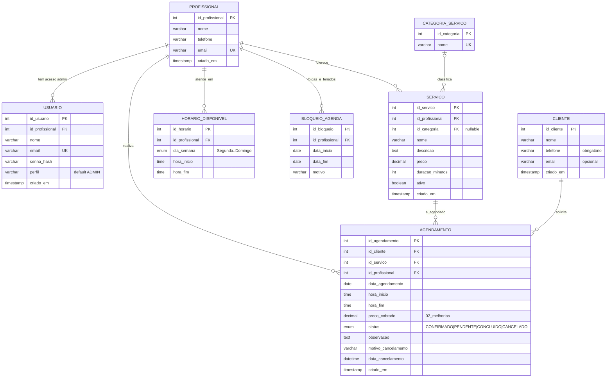
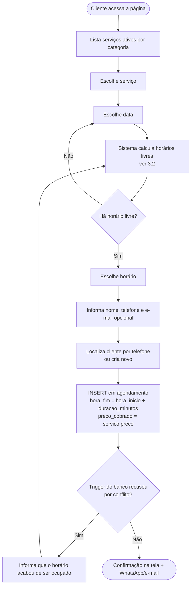
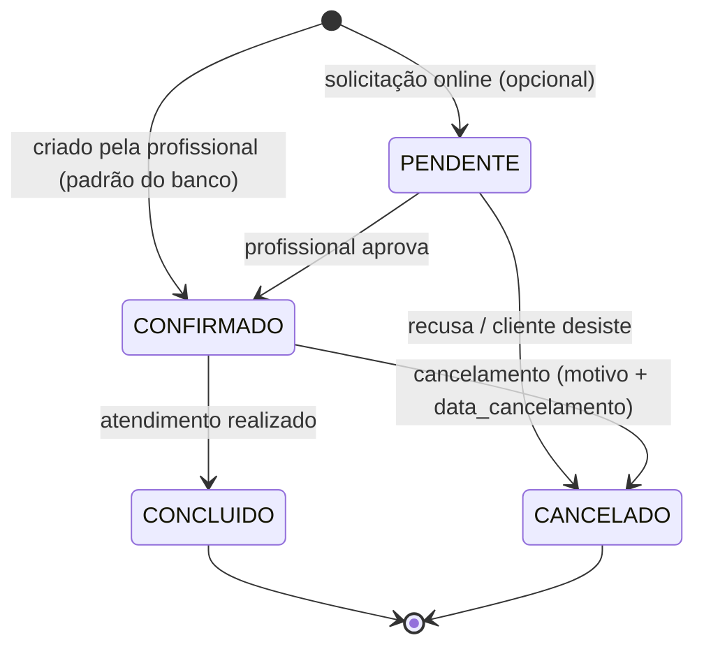
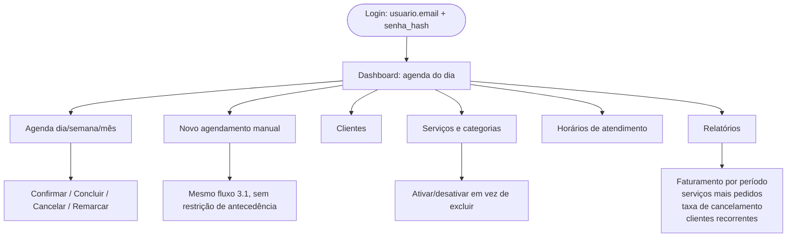

# Sistema de Agendamento — Modelagem inicial

> Projeto Integrador em Computação II · UNIVESP · **Grupo 4**
> Título provisório: *Sistema Web para Gestão de Serviços e Agendamentos: Uma Solução Tecnológica para Profissionais Autônomos*
>
> Este documento descreve o **modelo de dados**, os **fluxos principais** e a **interface web**,
> alinhados ao **Plano de Ação** e ao **Relatório Parcial** do grupo.
>
> **Decisão do grupo: banco de dados MySQL** (como no Relatório Parcial). A versão PostgreSQL feita antes
> continua em `database/postgres/` como alternativa, mas **não é a usada**.

---


---

## 0. Stack e andamento

| Camada | Tecnologia | Onde está |
|---|---|---|
| Banco relacional | **MySQL 8** (Workbench 8.0.36, como no Relatório Parcial) | `database/mysql/` |
| API REST | **Node.js + Express** (`mysql2`, JWT, bcrypt) | `backend/` |
| Interface | **React.js** (Vite), responsiva e acessível | `frontend/` |

> ⚠️ O Plano de Ação (Quinzenas 4–5) cita **PostgreSQL**, enquanto o Relatório Parcial entregue descreve **MySQL**.
> O grupo decidiu seguir o **MySQL**; vale registrar essa decisão (e o motivo) no Relatório Final e avisar o orientador.
> Veja `docs/REVISAO_RELATORIO_PARCIAL.md`.

**Andamento em relação ao Plano de Ação:**

| Quinzena | Atividade do plano | Situação |
|---|---|---|
| 3 | Modelagem: banco de dados e principais fluxos | ✅ este documento |
| 4 | Estrutura inicial do banco e integração | ✅ `database/mysql/` + `backend/` |
| 4 | API REST Node/Express | ✅ serviços, disponibilidade, agendamento, cancelamento, login, agenda |
| 4 | Interface React | ✅ fluxo do cliente + login + agenda da profissional |
| 5 | CRUD de serviços, horários e folgas (painel) | ⏳ API e telas ainda não existem |
| 5 | Acessibilidade e responsividade | 🟡 base feita (HTML semântico, foco, rótulos, contraste); falta auditoria |
| 5–6 | Testes e validação com a profissional | 🟡 testes automatizados feitos; falta validar com a profissional |

---

## 1. Visão geral do domínio

Sistema para uma profissional autônoma da área da beleza (cenário inicial: cabeleireira; dados de teste: *Mariana Souza*)
gerenciar **serviços**, **horários de atendimento** e **agendamentos** de clientes.

Atores:

| Ator | O que faz |
|---|---|
| **Cliente** | Escolhe serviço, dia e horário; recebe confirmação; pode cancelar. |
| **Profissional / Admin** (`usuario`) | Faz login, vê a agenda, cria/edita/cancela/conclui agendamentos, gerencia serviços, categorias, clientes e horários. |

---

## 2. Modelo de dados (MER)



### 2.1 Dicionário resumido

| Tabela | Papel | Regras no banco |
|---|---|---|
| `profissional` | Quem presta o serviço | `email` único |
| `usuario` | Login do painel | `email` único; `senha_hash` (bcrypt) |
| `categoria_servico` | Agrupa serviços | `nome` único |
| `servico` | Catálogo com preço e duração | `preco >= 0`, `duracao_minutos > 0` *(02)*; `ativo` desliga sem apagar |
| `horario_disponivel` | Grade semanal de atendimento | `hora_fim > hora_inicio` *(02)* |
| `bloqueio_agenda` *(02)* | Folgas, feriados, férias | `data_fim >= data_inicio` |
| `cliente` | Quem agenda | `telefone` obrigatório; índice por telefone *(02)* |
| `agendamento` | Reserva de serviço em data/hora | trigger anti-conflito; `hora_fim > hora_inicio` e `preco_cobrado` *(02)* |

*(02)* = acrescentado por `database/mysql/02_melhorias.sql`; o restante vem do script original (`01_schema_original.sql`).

### 2.2 Regras de negócio

**Regra central — sem horários sobrepostos para a mesma profissional.** Implementada por *triggers*
(`trg_impede_conflito_horario` no INSERT e `..._update` no UPDATE) do script original; ignoram `CANCELADO`
e permitem horários encostados (10–11 e 11–12). O erro é `SQLSTATE 45000` (errno 1644).

**Limite do trigger:** ele consulta e depois grava; duas requisições simultâneas poderiam passar juntas.
A API resolve isso: cada reserva roda numa transação `READ COMMITTED` que primeiro trava a linha da
profissional (`SELECT ... FOR UPDATE`), serializando as reservas. Se mesmo assim o trigger recusar,
a API devolve **HTTP 409** ("Esse horário acabou de ser ocupado").

| Regra | Onde é garantida |
|---|---|
| Sem sobreposição de horários | trigger (banco) + trava na API |
| `hora_fim > hora_inicio`, preço e duração válidos | `CHECK` (MySQL 8.0.16+) |
| Horário dentro do expediente, fora de folgas, não no passado, antecedência mínima | **API** (`backend/src/disponibilidade.js`) |
| Cliente identificado pelo telefone (só dígitos) | **API** |
| Preço histórico | `preco_cobrado` preenchido pela API |
| Histórico protegido | FKs de `agendamento` sem `CASCADE`; para "remover" serviço, `ativo = FALSE` |

## 3. Fluxos principais

### 3.1 Agendamento pelo cliente



### 3.2 Cálculo de horários disponíveis (regra que **não** está no banco)

```mermaid
flowchart LR
    A[Data escolhida] --> B[Converte a data em dia da semana]
    B --> C[Busca janelas em horario_disponivel]
    C --> C2[Descarta o dia se houver<br/>bloqueio_agenda]
    C2 --> D[Busca agendamentos do dia<br/>status diferente de CANCELADO]
    D --> E[Gera slots de 15 ou 30 min<br/>dentro de cada janela]
    E --> F[Descarta slots em que<br/>slot + duracao ultrapassa a janela]
    F --> G[Descarta slots que<br/>se sobrepõem a um agendamento]
    G --> H[Se for hoje, descarta horários passados]
    H --> I[Lista de horários livres]
```



Consultas de apoio (MySQL; `?` = parâmetro, a API usa sempre consultas parametrizadas):

```sql
-- Dia bloqueado? (se retornar linha, não há horários)
SELECT motivo FROM bloqueio_agenda
WHERE id_profissional = ? AND ? BETWEEN data_inicio AND data_fim;

-- Janelas do dia (a API converte a data em 'Segunda', 'Terca', ... — ENUM do banco)
SELECT TIME_FORMAT(hora_inicio,'%H:%i') AS hora_inicio, TIME_FORMAT(hora_fim,'%H:%i') AS hora_fim
FROM horario_disponivel
WHERE id_profissional = ? AND dia_semana = ?;

-- Ocupação do dia
SELECT TIME_FORMAT(hora_inicio,'%H:%i') AS hora_inicio, TIME_FORMAT(hora_fim,'%H:%i') AS hora_fim
FROM agendamento
WHERE id_profissional = ? AND data_agendamento = ? AND status <> 'CANCELADO';
```

O cálculo dos *slots* (passo de 30 min, cabe na janela, não sobrepõe) é feito em **JavaScript no
back-end** (`backend/src/slots.js`), com testes automatizados.

### 3.3 Ciclo de vida do agendamento



- Cancelar = `UPDATE agendamento SET status='CANCELADO', motivo_cancelamento=?, data_cancelamento=NOW()`.
  O horário volta a ficar livre automaticamente (o trigger ignora cancelados).
- **Nunca apagar** agendamentos: o histórico alimenta relatórios.

### 3.4 Fluxo administrativo



Exemplo de consulta para a agenda do dia:

```sql
SELECT a.id_agendamento, a.hora_inicio, a.hora_fim, a.status,
       c.nome AS cliente, c.telefone, s.nome AS servico, s.preco
FROM agendamento a
JOIN cliente c ON c.id_cliente = a.id_cliente
JOIN servico s ON s.id_servico = a.id_servico
WHERE a.id_profissional = :prof
  AND a.data_agendamento = :data
  AND a.status <> 'CANCELADO'
ORDER BY a.hora_inicio;
```

---

## 4. Banco de dados: como montar

Os scripts estão em `database/mysql/` (detalhes e passo a passo em `database/mysql/README.md`):

1. `01_schema_original.sql` — o banco do Relatório Parcial (7 tabelas, triggers, dados de teste);
2. `02_melhorias.sql` — `preco_cobrado`, `CHECK`s, índice por telefone e `bloqueio_agenda`;
3. `03_dev_admin.sql` — senha de teste do painel (**só desenvolvimento**);
4. `04_conta_cliente.sql` — tabela `conta_cliente` (`id_cliente` único → `cliente`, `email` único, `senha_hash`): conta **opcional**. Quem agenda sem conta continua só em `cliente`; clientes com conta nunca são reaproveitados por agendamentos sem conta.

Melhorias já aplicadas pelo `02` e pontos que ficam na API:

| Ponto identificado no script original | Situação |
|---|---|
| Sem validação `hora_fim > hora_inicio` | ✅ `CHECK` |
| Sem preço histórico no agendamento | ✅ `preco_cobrado` |
| Sem folgas/feriados | ✅ tabela `bloqueio_agenda` |
| `senha_hash` de exemplo inválido | ✅ `03_dev_admin.sql` (bcrypt real, só dev) |
| Trigger sem proteção contra requisições simultâneas | ✅ transação + `FOR UPDATE` na API |
| Agendar fora do expediente / no passado | ✅ API |
| `cliente.telefone` duplicável | ➡️ API reaproveita o cliente pelo telefone (só dígitos) |
| Serviço de uma profissional agendado com outra | ➡️ a API usa a profissional do próprio serviço |
| `DROP DATABASE` no início do `01` | ⚠️ apaga tudo se reexecutado — só em desenvolvimento |

---

## 5. Que tipo de interface web dá para fazer?

O plano pede um **sistema web acessível por computador e celular**, feito em **React.js**. Com este
banco dá para montar **uma aplicação React com duas áreas**:

### A) Área pública de agendamento (cliente) — *mobile-first*
Telas: **Serviços** → **Data** → **Horários livres** → **Seus dados** → **Confirmação**.
Extras: link para cancelar, botão de WhatsApp, link para compartilhar no Instagram.
Não exige login (o cliente é identificado pelo telefone).

### B) Painel administrativo (profissional) — computador/tablet/celular
| Tela | Conteúdo | Requisito do plano |
|---|---|---|
| Login | `usuario.email` + senha | — |
| Dashboard | Agenda de hoje, próximos clientes | — |
| Agenda | Calendário dia/semana/mês | controle de agenda |
| Agendamentos | Lista com filtros; confirmar, concluir, cancelar (com motivo), remarcar | prevenção de conflitos |
| Serviços / Categorias | CRUD, preço, duração, ativar/desativar | **cadastro, consulta e gerenciamento dos serviços** |
| Horários e folgas | Grade semanal + bloqueios | **dias e horários de atendimento** |
| Clientes | Cadastro, histórico, contato por WhatsApp | — |
| Relatórios *(fase posterior)* | Faturamento, serviços mais pedidos, cancelamentos | — |

**Já implementado:** Login e Agenda do dia (navegar entre dias, confirmar, concluir e cancelar com motivo, link de WhatsApp). As demais telas ficam para a Quinzena 5.

### Formato escolhido: SPA em React + API REST
- **Front-end:** React 18 + Vite + React Router; CSS próprio, mobile-first (`frontend/`).
- **Back-end:** Node.js + Express, API REST em JSON, `mysql2` com consultas parametrizadas (`backend/`).
- **Banco:** MySQL 8 (`database/mysql/`).
- **Segurança:** bcrypt para senhas, JWT de 8 h no painel, `helmet`, CORS configurável e limite de tentativas de login.
- **Nuvem (tema norteador):** front em hospedagem estática; API e MySQL em serviço que ofereça **MySQL de verdade** (triggers são a regra central).
- Evolução opcional: PWA.

### Acessibilidade e responsividade (requisitos do plano, Quinzenas 5 e 6)
HTML semântico, rótulos em todos os campos, navegação por teclado, contraste mínimo WCAG AA,
botões grandes para toque, mensagens de erro claras e layout fluido de 360 px a desktop.

### Endpoints da API (implementados — ver `backend/README.md`)
```
GET    /api/servicos                          # público – serviços ativos
GET    /api/disponibilidade?servico=&data=    # público – horários livres
POST   /api/agendamentos                      # público – cria (409 se houver conflito)
POST   /api/agendamentos/:id/cancelar         # público/admin – cancela com motivo

POST   /api/auth/login                        # admin
GET    /api/admin/agenda?inicio=&fim=         # admin
PATCH  /api/admin/agendamentos/:id            # admin – status/remarcar
GET    /api/admin/resumo                       # admin – dashboard
*      /api/admin/servicos | categorias        # admin – CRUD (excluir serviço com agendamento → 409)
*      /api/admin/horarios | bloqueios         # admin – janelas de atendimento e folgas
# a fazer: /api/admin/clientes, relatórios e conta de cliente (etapas 2 e 3)
```

### Estrutura de pastas
```
BD2/
├── database/mysql/     # scripts 01, 02 e 03 (MySQL)             ✅
├── database/postgres/  # versão alternativa, não usada           —
├── backend/            # Node + Express (npm run dev / npm test) ✅
├── frontend/           # React + Vite   (npm run dev / npm test) ✅
├── docker-compose.yml  # MySQL local opcional
└── docs/               # modelagem e revisão do relatório
```

---

## 6. Próximos passos (Quinzena 5: 05/10–18/10)

1. **Painel:** telas e endpoints de CRUD de serviços/categorias, horários de atendimento e folgas (Edinaldo e Lucas).
2. **Agendamento/disponibilidade e conflitos:** validar com a profissional o passo (15/30 min), a antecedência mínima e a regra de cancelamento (Amanda e Marcela).
3. **Integração e nuvem:** publicar API + MySQL + front (Mayer e Samara).
4. **Acessibilidade e responsividade:** auditoria com leitor de tela, teclado e celular real (Mayer e Nicolas).
5. **Lembretes por WhatsApp** (melhoria apontada no Relatório Parcial): hoje há apenas o link `wa.me` no painel.

**Decisões em aberto para o grupo:**
- O cliente agenda já como `CONFIRMADO` ou entra como `PENDENTE` até a profissional aprovar? (`STATUS_INICIAL` no `.env`)
- Prazo mínimo para o cliente cancelar?
- O objetivo do relatório cita **"pagamentos"**: haverá controle de pagamento ou será retirado do texto?
